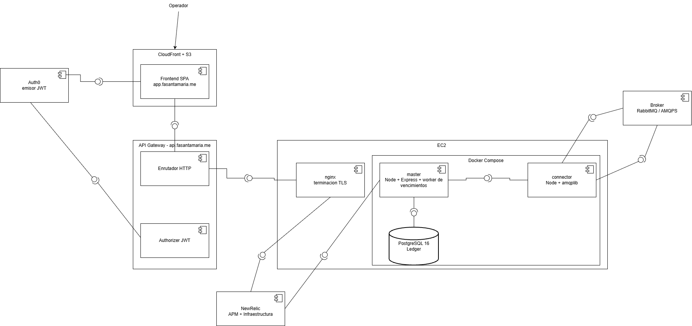

# Arquitectura de componentes

EnergyShark — ciudad **REE** (Re-Estize) · Grupo 3 · IIC2173

Este documento cubre RDOC03: el diagrama UML de componentes y la lectura de
cómo encajan las piezas. 

## Los componentes

| Componente | Tecnología | Responsabilidad |
| --- | --- | --- |
| Frontend SPA | React, servido por CloudFront desde S3 | Pantallas del ledger y de negociación. Obtiene el token de Auth0 y lo adjunta en cada llamada. |
| API Gateway | AWS HTTP API | Expone `api.fasantamaria.me`, aplica CORS y delega la validación del token al authorizer. |
| Authorizer JWT | Integrado en API Gateway | Valida firma, `iss` y `aud` contra el JWKS de Auth0. Nada sin token válido llega a la EC2. |
| nginx | En el host de la EC2 | Termina TLS y hace proxy hacia `master`. |
| master | Node + Express | Única pieza que escribe en el ledger. Expone la API REST, ingiere los eventos del connector y corre el worker de vencimientos. |
| connector | Node + amqplib | Consume de `city.REE.q` por AMQPS y publica hacia la central. No toca la base. |
| PostgreSQL 16 | Contenedor en la EC2 | Log append-only de eventos, mensajes rechazados y operaciones pendientes. |

Externos al sistema: El **broker**, **Auth0** como emisor de identidad y **New Relic** como destino de
métricas y trazas.